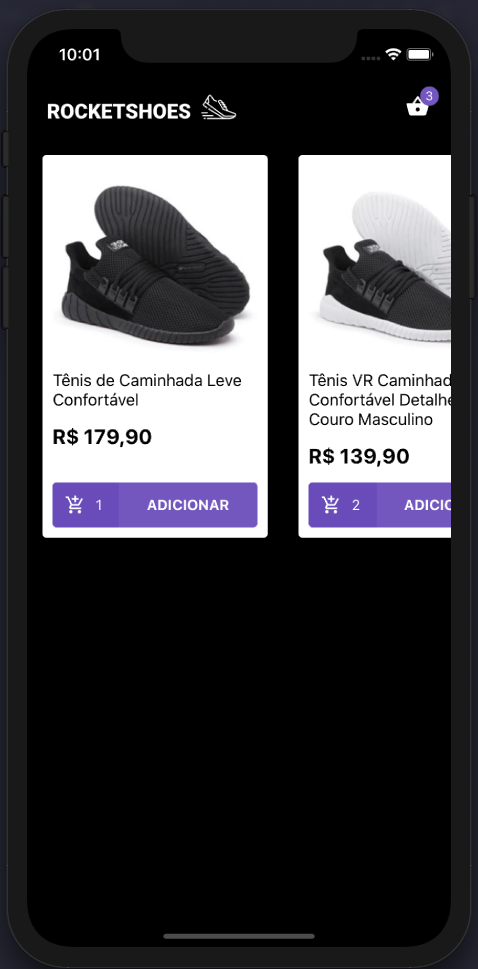
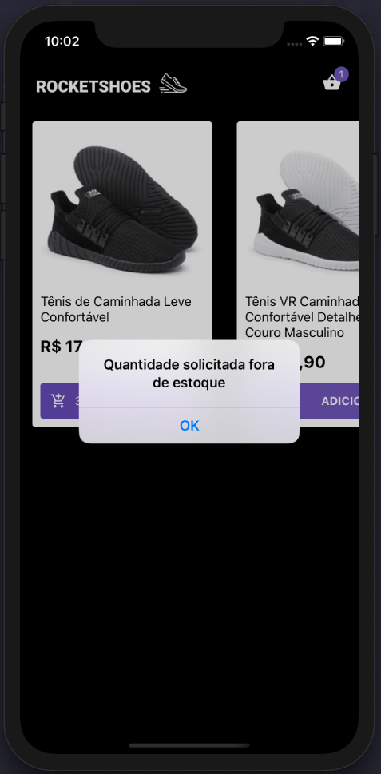
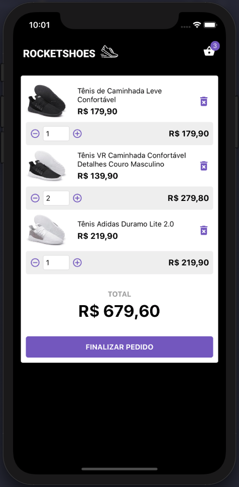
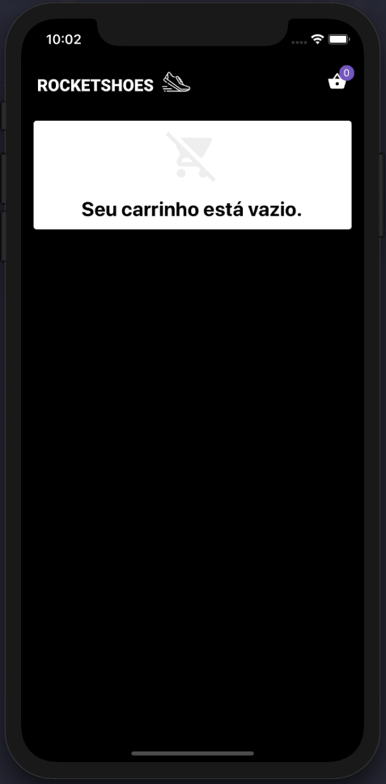
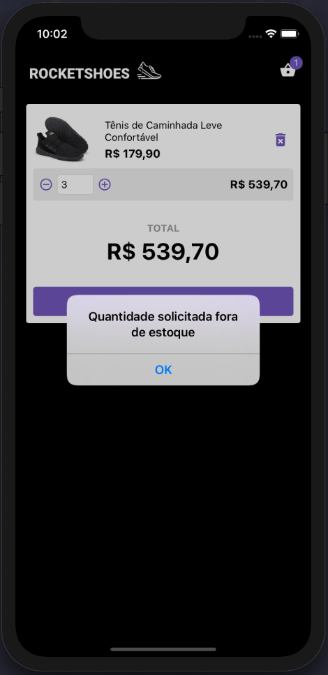

# Desafio 08: Utilizando React Hooks

<h1 align="center">
    
</h1>

## About

A ecommerce store in react native with react hooks (same as desafio07)

## Installation

Clone the project with

```sh
git clone https://github.com/cadohr/rocketseat-bootcamp-desafio08.git
```

Get in the project path

```sh
cd rocketseat-bootcamp-desafio08
```

Then install the dependencies with:

```sh
yarn
```

Start server with:

```sh
yarn server
```

Open new terminal tab and start application with:

```sh
react-native run-ios || react-native run-android
```

## Screenshot

    
